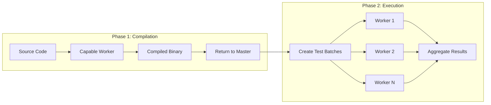
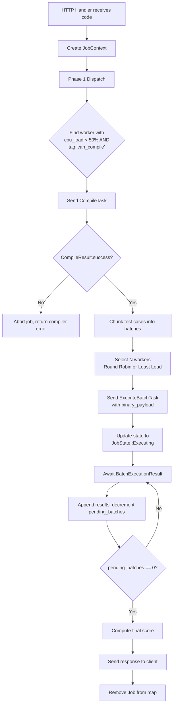
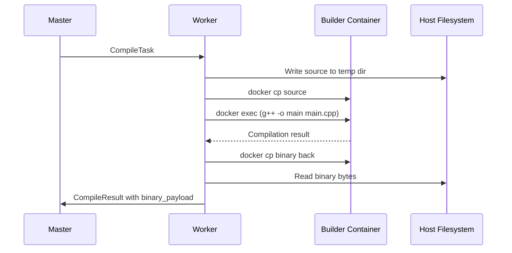
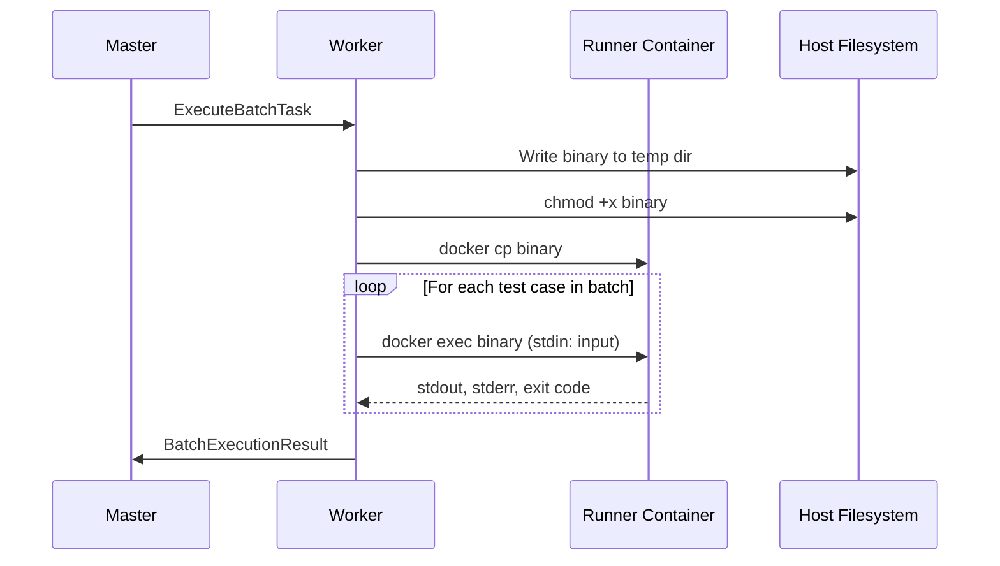

# Distributed Code Execution System: Agent Reference Spec

**Version:** 2.0 (Split-Phase Pipeline)  
**Target Environment:** Heterogeneous LAN (100+ nodes), Single Static IP Master, Dynamic/Subnetted Workers  
**Core Language:** Rust

---

## 1. Architectural Overview

### 1.1 Topology: Reverse Star (Hub-and-Spoke)

Due to network constraints (unknown subnets, dynamic IPs, potential NATs), the system utilizes a **Worker-Initiated Connection** model.

| Component | Role |
|-----------|------|
| **Master Node** | Central command server on a known Static IP. Exposes a gRPC server for workers and an HTTP API for clients. |
| **Worker Nodes** | Stateless execution units. Dial the Master to register availability and maintain a persistent HTTP/2 (gRPC) stream to receive jobs. |
| **Clients** | Communicate strictly with the Master via HTTP REST/JSON. |

### 1.2 The Split-Phase Execution Pipeline

To optimize for compiled languages (C++, Rust, Go), execution is split into two distinct phases to avoid redundant compilations.



#### Phase 1: Compilation (The Build Step)

1. Source code is sent to one capable worker
2. Worker compiles code to a standalone binary
3. Binary is returned to Master (memory-to-memory)

#### Phase 2: Execution (The Run Step)

1. Master creates batches of test cases
2. Binary + Batches are distributed to multiple workers in parallel
3. Workers execute binary against inputs and return metrics

---

## 2. Technology Stack

| Category | Technology | Purpose |
|----------|------------|---------|
| Language | **Rust** | Core implementation |
| Async Runtime | `tokio` | Multi-threaded scheduler |
| RPC Framework | `tonic` | gRPC over HTTP/2 |
| Serialization | `prost` | Protocol Buffers |
| HTTP Server | `axum` | Client API |
| Container Interface | `bollard` | Native Rust Docker client |
| State Management | `dashmap` | Concurrent HashMaps |
| IDs | `uuid` | Unique identifiers |

---

## 3. Interface Definitions (Protobuf Schema)

> **File:** `proto/scheduler.proto`

```protobuf
syntax = "proto3";
package scheduler;

service WorkerService {
  // Worker initiates connection and keeps stream open.
  // Master pushes commands down this stream.
  rpc Connect (stream WorkerMessage) returns (stream MasterCommand);
}
```

### 3.1 Worker → Master Messages

```protobuf
message WorkerMessage {
  oneof payload {
    Register register = 1;
    Heartbeat heartbeat = 2;
    CompileResult compile_result = 3;      // Response to Phase 1
    BatchExecutionResult batch_result = 4; // Response to Phase 2
  }
}

message Register {
  string worker_id = 1;      // UUID generated by worker on startup
  uint32 cpu_cores = 2;
  uint64 total_ram_mb = 3;
  repeated string tags = 4;  // e.g., ["can_compile", "high_memory"]
}

message Heartbeat {
  string worker_id = 1;
  float cpu_load_percent = 2;
  uint64 ram_usage_mb = 3;
  uint32 active_tasks = 4;
}

message CompileResult {
  string job_id = 1;
  bool success = 2;
  string compiler_output = 3; // GCC/Rustc stderr for user display
  bytes binary_payload = 4;   // The compiled executable (if success)
  int32 duration_ms = 5;
}

message BatchExecutionResult {
  string job_id = 1;
  string batch_id = 2;
  string worker_id = 3;
  repeated TestCaseResult results = 4;
  ResourceMetrics metrics = 5; // Aggregate metrics for the batch
  string system_error = 6;     // If docker failed/crashed
}

message TestCaseResult {
  string test_id = 1;
  string status = 2; // "PASSED", "FAILED", "TLE" (Time Limit), "RE" (Runtime Error)
  string stdout = 3; // Truncated output
  string stderr = 4;
  int32 time_ms = 5;
  int32 memory_bytes = 6;
}

message ResourceMetrics {
  uint64 peak_ram_bytes = 1;
  uint64 total_cpu_time_ms = 2;
}
```

### 3.2 Master → Worker Messages

```protobuf
message MasterCommand {
  oneof task {
    CompileTask compile = 1;
    ExecuteBatchTask execute = 2;
    ShutdownRequest shutdown = 3;
  }
}

message CompileTask {
  string job_id = 1;
  string language = 2;
  string source_code = 3;
  repeated string flags = 4; // e.g., ["-O3", "-std=c++20"]
}

message ExecuteBatchTask {
  string job_id = 1;
  string batch_id = 2;
  string language = 3;
  
  // Payload: Source for interpreted, Binary for compiled
  oneof payload {
      string source_code = 4;
      bytes binary_artifact = 5;
  }
  
  repeated TestCase inputs = 6;
  uint32 time_limit_ms = 7;
  uint32 memory_limit_mb = 8;
}

message TestCase {
  string id = 1;
  string input = 2;
  string expected_output = 3;
}

message ShutdownRequest {
  string reason = 1;
}
```

---

## 4. Master Node Implementation Guide

### 4.1 State Management

Use `DashMap` for lock-free concurrency.

```rust
struct JobContext {
    id: String,
    total_test_cases: usize,
    // Store results as they come in from various batches
    results: Vec<TestCaseResult>,
    state: JobState,
    // Channel to reply to the HTTP thread once done
    responder: tokio::sync::oneshot::Sender<FinalResponse>,
}

enum JobState {
    Compiling,
    Executing { pending_batches: usize },
}

struct AppState {
    // Active connections: WorkerID -> gRPC Stream Sender
    workers: DashMap<String, mpsc::Sender<Result<MasterCommand, Status>>>, 
    // Active Jobs
    jobs: DashMap<String, JobContext>,
}
```

### 4.2 Handling Workflow



#### Detailed Steps

1. **Submission:** HTTP Handler receives code, creates `JobContext`
2. **Phase 1 Dispatch:** Find a worker with `cpu_load < 50%` and tag `can_compile`, send `CompileTask`
3. **Phase 1 Result:**
   - If `CompileResult.success == false`: Abort job, return compiler error
   - If `success == true`:
     - Chunk test cases into batches (e.g., 20 cases per batch)
     - Select N workers (Round Robin or Least Load)
     - Send `ExecuteBatchTask` (includes `binary_payload`) to each
     - Update state to `JobState::Executing`
4. **Phase 2 Aggregation:**
   - On `BatchExecutionResult`: Append results to `JobContext`, decrement `pending_batches`
   - If `pending_batches == 0`: Compute final score, send response to client, remove Job from map

---

## 5. Worker Node Implementation Guide

### 5.1 Connection Loop

Workers must be resilient to Master downtime.

```rust
// Startup connection loop
loop {
    match connect(MASTER_IP).await {
        Ok(stream) => {
            // Send Register immediately
            stream.send(Register { ... }).await;
            
            // Process commands until disconnected
            process_commands(stream).await;
        }
        Err(_) => {
            // Retry after delay
            tokio::time::sleep(Duration::from_secs(5)).await;
        }
    }
}
```

**Concurrent Tasks:**

| Task | Description |
|------|-------------|
| **Heartbeat** | Timer task sending metrics every 5 seconds |
| **Command Processor** | Await `stream.message()` and route to Docker logic |

> [!TIP]
> Consider implementing exponential backoff with jitter for reconnection attempts to avoid thundering herd problems when the master restarts.

### 5.2 The "Warm Pool" Strategy

Spawning containers is slow. Workers should maintain idle pools of pre-warmed containers.

| Pool Type | Quantity | Image | Purpose |
|-----------|----------|-------|---------|
| **Builder Pool** | 1-2 containers | `gcc:latest` | Compilation tasks |
| **Runner Pool** | 5-10 containers | `alpine` or `debian:slim` | Execution tasks |

#### Setup Commands

```bash
# Builder container (with make installed)
docker run -d --name warm_builder_1 gcc sleep infinity

# Runner containers (isolated, read-only)
docker run -d --network none --read-only --name warm_runner_X alpine sleep infinity
```

> [!IMPORTANT]
> Ensure containers are recycled after a certain number of executions or time period to prevent resource leaks and potential security issues from accumulated state.

### 5.3 Execution Logic (Bollard)

#### Compile Request Flow



#### Execute Request Flow



> [!CAUTION]
> **CRITICAL:** Use `tokio::time::timeout` on the `docker exec` future to enforce strict timeouts. Untrusted code may attempt to hang indefinitely.

---

## 6. Docker & Security Configuration

> [!WARNING]
> Workers are untrusted environments running untrusted code. Apply defense-in-depth!

### Container Security Constraints

| Constraint | Setting | Purpose |
|------------|---------|---------|
| **Network** | `NetworkDisabled: true` | No internet access for user code |
| **Filesystem** | `ReadonlyRootfs: true` | Prevent persistent modifications |
| **Temp Storage** | Mount `/tmp` as `tmpfs` (RAM disk) | Allow writing output files in memory only |
| **PIDs** | `PidsLimit: 50` | Prevents fork bombs |
| **Memory** | `Memory: 128MB` | Hard memory limit |
| **CPU** | `NanoCPUs: 1_000_000_000` (1 Core) | CPU quota |

### Recommended Docker Run Flags

```bash
docker run \
  --network none \
  --read-only \
  --tmpfs /tmp:rw,noexec,nosuid,size=64m \
  --pids-limit 50 \
  --memory 128m \
  --cpus 1 \
  --security-opt no-new-privileges \
  runner_image
```

> [!TIP]
> Consider adding `--security-opt seccomp=custom_profile.json` for additional syscall filtering, and `--cap-drop ALL` to remove all Linux capabilities.

---

## 7. Development Roadmap

### Phase 1: Skeleton

- [ ] Define `.proto` schema
- [ ] Implement basic Master server (accepts connections)
- [ ] Implement basic Worker client (connects and sends Heartbeat)
- [ ] **Milestone:** Verify Master sees the Heartbeat

### Phase 2: Remote Execution (Simple)

- [ ] Implement `ExecuteTask` (Phase 2 logic only) for Python (interpreted)
- [ ] Worker uses `bollard` to run Python code in Docker
- [ ] **Milestone:** Master sends task, Worker returns "Hello World"

### Phase 3: The Pipeline

- [ ] Implement `CompileTask` logic
- [ ] Implement Binary handling (transferring `Vec<u8>` via gRPC)
- [ ] Implement Batching logic on Master

### Phase 4: Production Polish

- [ ] Add Warm Pools to Worker
- [ ] Add timeouts and memory limits monitoring
- [ ] Implement `axum` HTTP frontend

---

## Appendix: Potential Improvements

> [!NOTE]
> These are suggested enhancements to consider for production readiness.

### A. Fault Tolerance

- **Worker Failure Handling:** If a worker dies mid-batch, the Master should detect this (via heartbeat timeout) and reassign the batch to another worker.
- **Job Timeout:** Add a global job timeout to prevent indefinitely hanging jobs.

### B. Observability

- **Metrics:** Expose Prometheus metrics for job throughput, latency percentiles, worker health, etc.
- **Tracing:** Integrate with OpenTelemetry for distributed tracing across Master ↔ Worker communication.

### C. Caching

- **Binary Caching:** Cache compiled binaries keyed by source hash to skip redundant compilations for identical submissions.
- **Container Image Caching:** Pre-pull all required Docker images on worker startup.

### D. Load Balancing Improvements

- **Weighted Round Robin:** Factor in worker capabilities (CPU cores, RAM) when distributing batches.
- **Work Stealing:** Allow idle workers to request batches from overloaded workers.